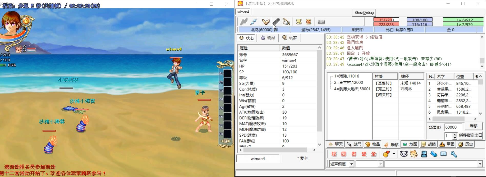

<h1>🎮 漂流小蝦</h1>

漂流幻境輔助程式（原漂流無雙增強版！自動行走、自動戰鬥、自動吃補、地圖大瞬移……）

目前免費試用，意見徵集中！

---

<h2>🚀 下载最新版</h2>

最新版本：<b>v2.0.0</b> · 文件名：<code>2.0.0.7z</code>

  

 
<a class="download-button" href="https://github.com/wiman4/wlboy/releases/download/wlboy/2.0.0.7z" download>⬇️ 点击下载 漂流小蝦 v2.0.0</a>

  

<h2>🧾 更新紀錄</h2>

**更新日期：** 2025 年 10 月 31 日　01:50:16  

### 🆕 本次更新內容
1. ✨ 新增 **「瞬移指定出口」** 功能，可直接選擇並傳送至特定地點。  
2. 🗂️ 新增 **自動記錄與更新瞬移出口清單檔** `ScnList.txt`，讓瞬移目標可即時同步。  

---

💡 **提示：**  
此版本著重於提升瞬移系統的便利性與可管理性，建議舊版本使用者盡快更新。

---

<h3>🔗 備用下載方式</h3>

如遇無法下載，可右鍵“另存目標”，或使用 GitHub 直鏈： 
<a href="https://github.com/wiman4/wlboy/releases/download/wlboy/2.0.0.7z" target="_blank">
https://github.com/wiman4/wlboy/releases/download/wlboy/2.0.0.7z
</a>

---

<h3>📂 項目信息</h3>

🌐 官方主頁：<a href="https://wiman4.github.io/wlboy/">https://wiman4.github.io/wlboy/</a> 
💻 GitHub 倉庫：<a href="https://github.com/wiman4/wlboy">https://github.com/wiman4/wlboy</a> 

---

✨ 感謝使用 漂流小蝦！歡迎點 <a href="https://github.com/wiman4/wlboy" target="_blank">⭐ Star</a> 支援項目。

